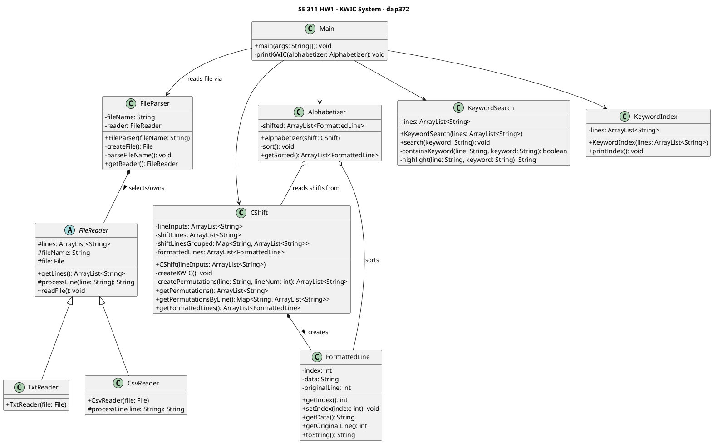

# Module Design - UML Class Diagram

## How this design accommodates the possible future changes

**1. Input format changes (`.txt` → `.csv` / others): already supported (to test abstraction)**
`FileReader` is abstract and owns the shared reading algorithm (`readFile()`); the only
thing a subclass supplies is `processLine()`, a hook for per-format transformation
(`CsvReader` strips commas, `TxtReader` uses the default option). `FileParser` is a small factory:
it inspects the file extension and switches on it to pick a `FileReader` subclass.
Adding a new format (e.g. JSON) means adding one new `FileReader` subclass and one new
`switch` branch. No existing class changes are necessary.

**2. Index generation policy (stop-word filtering): not yet implemented, low-cost to
add.** All tokenizing for the index happens in one place: the loop inside
`KeywordIndex.printIndex()`. Because that responsibility isn't scattered across other
classes, adding stop-word support is a localized change: add a `Set<String> stopWords`
as a constructor parameter on `KeywordIndex`, and skip
matching words before they're inserted into the `TreeMap`. No other classes need to be changed.

**3. Alphabetizing policy (ascending/descending, case sensitivity): currently a gap.**
`Alphabetizer.sort()` hardcodes a single
`Comparator.comparing(FormattedLine::getData, CASE_INSENSITIVE_ORDER)`. There's no abstraction or switch/case
that I have implemented for choosing a different policy. The fix is to turn
the comparator into a Strategy: accept a `Comparator<String>` in the `Alphabetizer`
constructor (also an option, but a `setComparator()` method might be easier to implement) 
instead of hardcoding one, and have `Main` map a console command/flag to one of a few pre-built comparators (natural order,
reversed, case-sensitive, case-insensitive).

**4. Output method changes (console → file/web): currently a gap.** `KeywordIndex`,
`KeywordSearch`, and `Main` all call `System.out.println` / `System.err.println`
directly, so the current output is very much reliant on console. The fix is to introduce a thin
`OutputWriter` interface (e.g. `void write(String line)`), implement a
`ConsoleWriter` that wraps the current behavior, and pass an `OutputWriter` into each
class instead of calling `System.out` directly. `FileWriter`/`HtmlWriter`
implementations could then be swapped in without touching `KeywordIndex`,
`KeywordSearch`, or the KWIC printing logic. This can be implemented at the next itteration.
